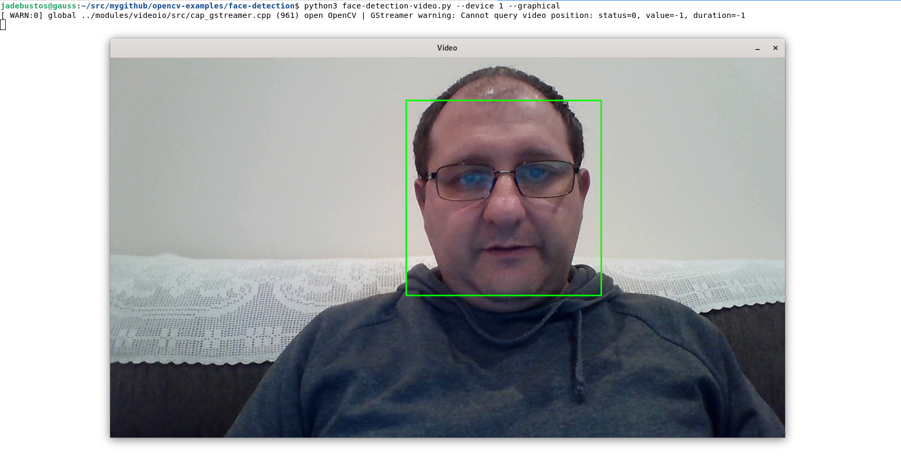

# Face Detection Video

**face-detection-video.py** is a python script that detects faces on a webcam. The **haarcascade_frontalface_default.xml** must be present in the same directory.

It has to parameters:

* **--device or -d** which is used to set the video device by its index. If the device for the webcam is **/dev/video0** then **--device 0** needs to be used. This parameter is mandatory.
* **--graphical** if this script is used in a workstation with a X-window environment. A window will be opened to show webcam images using a square surrounding faces when this parameter is used. As we are going to run this script inside a container we will not use this parameter. It is only included for testing/troubleshooting purposes when the application is executed in standalone mode (not in a container). This parameter is optional.



>  When in graphical mode use **q** to quit.

To execute the application:

```console
$ python face-detection-video.py --device 0
```
At this point when a face is detected the face is stored in a file named **frame.jpg** in the same directory where the script is stored.

You can copy it from the running container using the podman **cp** command.

## Looking for information about your camera(s)

```console
[jadebustos@archimedes face-detection]$ v4l2-ctl --list-devices
OBS Virtual Camera (platform:v4l2loopback-000):
	/dev/video0

HD Pro Webcam C920 (usb-0000:00:14.0-2.1.3):
	/dev/video5
	/dev/video6
	/dev/media2

Integrated Camera: Integrated C (usb-0000:00:14.0-8):
	/dev/video1
	/dev/video2
	/dev/video3
	/dev/video4
	/dev/media0
	/dev/media1

[jadebustos@archimedes face-detection]$
```

You can get information about the webcam:

```console
[jadebustos@archimedes face-detection]$ v4l2-ctl -d /dev/video5 --list-formats
ioctl: VIDIOC_ENUM_FMT
	Type: Video Capture

	[0]: 'YUYV' (YUYV 4:2:2)
	[1]: 'MJPG' (Motion-JPEG, compressed)
[jadebustos@archimedes face-detection]$
```

Or the extended one:

```console
[jadebustos@archimedes face-detection]$ v4l2-ctl -d /dev/video5 --list-formats-ext
ioctl: VIDIOC_ENUM_FMT
	Type: Video Capture

	[0]: 'YUYV' (YUYV 4:2:2)
		Size: Discrete 640x480
			Interval: Discrete 0.033s (30.000 fps)
			Interval: Discrete 0.042s (24.000 fps)
			Interval: Discrete 0.050s (20.000 fps)
			Interval: Discrete 0.067s (15.000 fps)
			Interval: Discrete 0.100s (10.000 fps)
			Interval: Discrete 0.133s (7.500 fps)
			Interval: Discrete 0.200s (5.000 fps)
...
[jadebustos@archimedes face-detection]$
```

